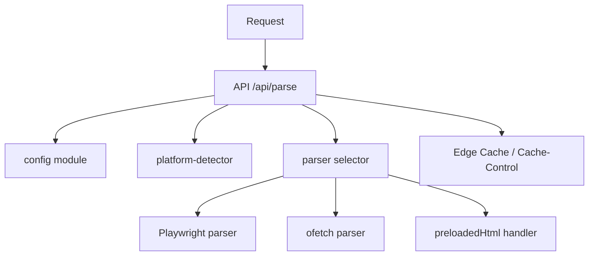

# Design Document

## Overview

为 `vercel-bu-shu-liu-cheng` 规格提供详细实现设计，确保在 Vercel 平台上稳定构建和运行 `ios-content-parser` 服务。设计覆盖环境变量管理、构建与运行配置、Playwright 的 Serverless 降级策略、缓存和 CORS 策略、监控与回滚方案，以及测试与验证步骤。

## Steering Document Alignment

### Technical Standards (tech.md)
遵循仓库已有约定：TypeScript、Next.js App Router、集中配置模块、单元与集成测试覆盖关键解析路径。

### Project Structure (structure.md)
保持现有 `src/lib`、`src/app/api`、`src/parsers` 结构，新的配置与运行时检测逻辑放在 `src/lib/config.ts` 与 `src/lib/platform.ts`（或已存在的 `platform-detector.ts`）中。

## Code Reuse Analysis

### Existing Components to Leverage
- **`src/lib/utils/platform-detector.ts`**: 用于检测运行环境（Vercel / 本地 / CI）。
- **`src/lib/ai/config.ts`**: 集中 AI 相关环境变量读取与降级逻辑。
- **`src/parsers/*`**: 复用现有 parser 实现（Playwright、ofetch、wechat 等）。

### Integration Points
- **API 端点**: `/src/app/api/parse/route.ts` 为主要集成点，需在该文件中读取 `config` 并根据平台选择解析策略与缓存头。
- **Vercel 配置**: `vercel.json` 用于声明 `buildCommand` 与 `functions.maxDuration`、CORS 与 headers 配置。

## Architecture

服务在请求到来时通过 `platform-detector` 判定是否在 Vercel Serverless 环境；若是则：

- 禁用 Playwright 浏览器下载（通过环境变量 `PLAYWRIGHT_SKIP_BROWSER_DOWNLOAD=1`）。
- 若目标源需要动态渲染，则优先尝试基于 `preloadedHtml` 的 ofetch 方案；若没有可用 `preloadedHtml`，则返回降级提示并提供可复制的 iOS Shortcuts 示例。

组件间关系：



### Modular Design Principles
- 单一职责：配置、平台检测、解析器实现相互隔离。
- 可插拔解析器：ParserSelector 根据策略选择解析器实例。

## Components and Interfaces

### config (src/lib/ai/config.ts)
- Purpose: 集中读取并暴露环境变量（ENABLE_AI、LLM_API_KEY、PLAYWRIGHT_SKIP_BROWSER_DOWNLOAD、API_TIMEOUT、AI_DEBUG 等），并提供 `isAiEnabled()`、`getTimeout()` 等函数。
- Interfaces: `getConfig(): Config`, `isAiEnabled(): boolean`, `effectivePlaywrightSkip(): boolean`

### platform-detector (src/lib/platform-detector.ts)
- Purpose: 检测运行环境（Vercel/Netlify/Local）。
- Interfaces: `isVercel(): boolean`, `isServerless(): boolean`

### parser-selector (src/lib/parsers/index.ts)
- Purpose: 根据 url、platform、headers、input 参数（如 preloadedHtml）选择合适解析器。
- Interfaces: `selectParser(opts): Parser`, `parseWithSelected(opts): ParseResult`

## Data Models

### ParseRequest
```
- url: string
- preloadedHtml?: string
- forceParser?: 'playwright' | 'ofetch' | 'wechat'
- headers?: Record<string,string>
```

### ParseResult
```
- title?: string
- content?: string
- images?: string[]
- publishTime?: string
- raw?: any
```

## Error Handling

### Error Scenarios
1. Playwright 无法在 Serverless 环境中启动
   - Handling: 记录警告并改用 ofetch/预取 HTML；返回降级信息到响应头/日志
   - User Impact: 解析仍然可用，但可能在动态渲染内容上有差异；响应中提示使用 `preloadedHtml`

2. AI 密钥未配置或失效
   - Handling: `isAiEnabled()` 返回 false，AI 增强路径被跳过；记录 warn 级日志
   - User Impact: 返回基础解析结果，且响应包含说明“不支持 AI 增强”的元信息

3. 外部请求超时/失败
   - Handling: 按 `API_TIMEOUT` 中止请求并应用重试（最多 2 次，指数退避）；若仍失败返回 502/504
   - User Impact: 返回错误 JSON，并在响应头中说明重试与超时配置

## Testing Strategy

### Unit Testing
- 覆盖 `platform-detector`、`config`、以及 `parser-selector` 的选择逻辑。

### Integration Testing
- 使用本地 Next.js 测试服务器对 `/api/parse` 发起集成测试，模拟 Vercel 环境变量并验证缓存头及降级行为。

### End-to-End Testing
- 使用示例 URL（如小红书示例）在 CI 上运行两套：启用 Playwright（在非 serverless runner）与禁用 Playwright（模拟 Vercel），对比关键字段一致性。

## Deployment and Rollback

- `vercel.json` 将包含 `buildCommand: "next build --turbopack"` 与 `functions.maxDuration=30`。
- 部署后通过 `/api/parse` 做烟雾测试（返回 200 + 正确 Cache-Control）。
- 若错误率上升，使用 Vercel 控制台回滚到上一个版本。

## Observability

- 在 API 中记录关键指标：请求时长、parser 类型、是否使用 preloadedHtml、错误码。
- 建议在 Vercel 上开启 Function logs 与 Metrics，并将重要告警导出到团队的 SRE 工具。

## Migration and Rollout Plan

- 在主分支上先合并 config 与 platform-detector 的改造，发布到 Preview 环境并运行 smoke tests。
- 逐步打开 Production 部署，观察 24 小时指标后全部切换。

## Open Questions

- 是否需要额外的成本计算或限流策略以避免 Playwright 在非生产环境的成本暴涨？
- 是否采用外部存储（比如 S3）缓存预渲染页面？

---

Generated from requirements.md and design template.
